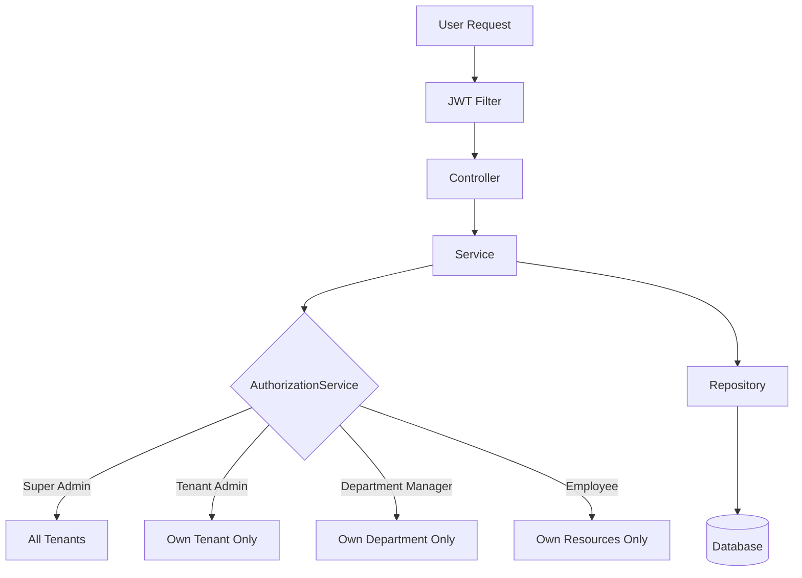
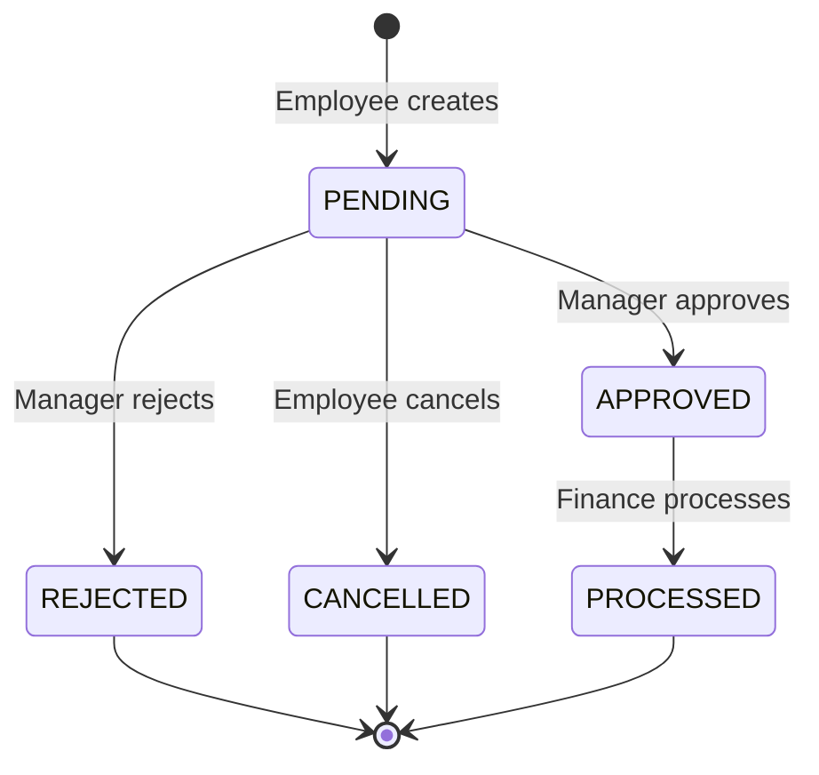
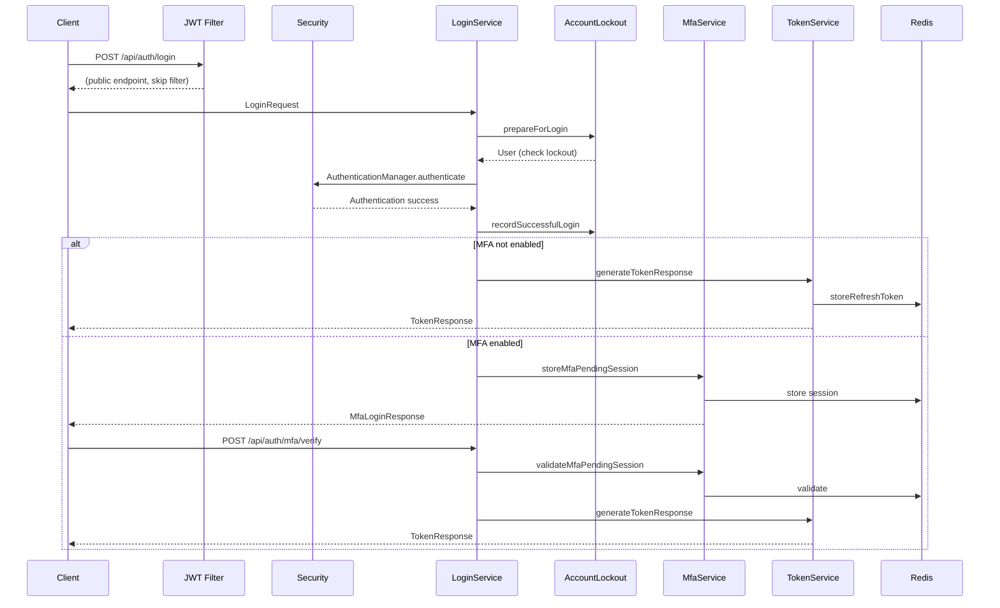

# System Architecture

## 1. Architecture Overview

The application is a **multi-tenant expense management system** built with Spring Boot. It follows a traditional **layered monolith** architecture with clear separation of concerns across controller, service, repository, and entity layers.

```
┌─────────────────────────────────────────────────────────────┐
│                        Client                               │
│                   (Web / SPA)                               │
└────────────────────────┬────────────────────────────────────┘
                         │ HTTP/HTTPS
┌────────────────────────▼────────────────────────────────────┐
│                   Spring Boot Application                   │
│  ┌──────────────────────────────────────────────────────┐   │
│  │              Security Filter Chain                   │   │
│  │         (JWT Authentication Filter)                  │   │
│  └──────────────────────────┬───────────────────────────┘   │
│  ┌──────────────────────────▼───────────────────────────┐   │
│  │              Controller Layer                        │   │
│  │    (REST Controllers, DTO Validation)                │   │
│  └──────────────────────────┬───────────────────────────┘   │
│  ┌──────────────────────────▼───────────────────────────┐   │
│  │              Service Layer                           │   │
│  │    (Business Logic, Authorization)                   │   │
│  └──────────────────────────┬───────────────────────────┘   │
│  ┌──────────────────────────▼───────────────────────────┐   │
│  │              Repository Layer                        │   │
│  │         (Spring Data JPA)                            │   │
│  └──────────────────────────┬───────────────────────────┘   │
└─────────────────────────────┼───────────────────────────────┘
                              │
            ┌─────────────────┼─────────────────┐
            │                 │                 │
   ┌────────▼──────┐ ┌───────▼───────┐ ┌───────▼───────┐
   │   PostgreSQL   │ │     Redis     │ │  SMTP Server  │
   │  (Production)  │ │  (Tokens,    │ │  (Emails)     │
   │                │ │   MFA, Rate   │ │               │
   │   H2 (Dev)     │ │   Limiting)  │ │               │
   └────────────────┘ └───────────────┘ └───────────────┘
```

**Key architectural characteristics:**
- **Stateless authentication** via JWT tokens
- **Multi-tenancy** with data isolation per tenant
- **Role-based access control** with fine-grained permissions
- **Domain-oriented service decomposition** (auth, expense, approval, finance)

## 2. Technology Stack

| Component | Technology | Version | Purpose |
|-----------|-----------|---------|---------|
| Language | Java | 21 | Runtime |
| Framework | Spring Boot | 3.2.5 | Application framework |
| Security | Spring Security | (managed) | Authentication & authorization |
| ORM | Spring Data JPA / Hibernate | (managed) | Database access |
| Database (dev/test) | H2 | (managed) | In-memory relational DB |
| Database (prod) | PostgreSQL | 16 | Production relational DB |
| Cache/Session | Redis | 7 | Token storage, MFA sessions, rate limiting |
| Migrations | Flyway | (managed) | Schema versioning |
| JWT | jjwt | 0.12.5 | Token generation and validation |
| MFA | dev.samstevens.totp | 1.7.1 | TOTP generation and verification |
| Mapping | ModelMapper | 3.2.0 | Entity-to-DTO mapping |
| Email | Spring Boot Mail | (managed) | SMTP email sending |
| Monitoring | Actuator + Micrometer + Prometheus | (managed) | Health, metrics, Prometheus endpoint |
| Validation | Jakarta Bean Validation | (managed) | Input validation |
| Build | Maven | 3.x | Build and dependency management |
| Container | Docker + docker-compose | - | Multi-stage build, orchestration |
| Testing | JUnit 5 + Mockito + AssertJ | (managed) | Unit and integration tests |

## 3. Application Structure

```
com.example.demo
├── config/           — Spring configuration, security config, exception handling
├── constants/        — Shared constants (authorities, roles, permissions, audit actions)
├── controller/       — REST controllers (thin, HTTP only)
├── dto/              — Request/response DTOs
├── entity/           — JPA entities
├── mapper/           — Entity-to-DTO mappers (@Component)
├── repository/       — Spring Data JPA repositories
├── security/         — JWT, filters, auth services, audit logger
│   ├── audit/        — Security audit logging
│   ├── filter/       — JWT authentication filter
│   ├── jwt/          — JWT token provider
│   └── service/      — Authorization, rate limiting, token hashing, IP resolution
├── service/          — Business logic services
└── validation/       — Custom validators
```

**Responsibility of major packages:**

- **config**: Contains `SecurityConfig` (Spring Security filter chain), `CorsConfig`, `JwtConfig`, `AppProperties`, `MfaProperties`, `SecurityProperties`, `GlobalExceptionHandler`, `AppConfig`.
- **constants**: Defines `Authorities` (permission string constants), `Roles` (role name constants), `UserPermission` (permission enum), `AuditActions` (audit event constants).
- **controller**: Eight REST controllers handling HTTP concerns only. All return `ResponseEntity<ApiResponse<T>>`.
- **dto**: 32 DTOs for API requests and responses. No business logic.
- **entity**: 9 entity classes + 3 enums. Entities implement `UserDetails` where applicable (User). Use `@Getter/@Setter/@Builder`.
- **mapper**: 6 `@Component` mappers for entity-to-DTO conversion.
- **repository**: 7 Spring Data JPA repositories.
- **security**: JWT filter, token provider, authorization service, rate limiting, token hashing, IP resolution, security audit logger.
- **service**: 16 business services with clear domain boundaries.

## 4. Layered Architecture

### Controller Layer
- Eight controllers: `AuthController`, `MfaController`, `ExpenseController`, `UserManagementController`, `RoleManagementController`, `TenantManagementController`, `DepartmentManagementController`, `AuditLogController`.
- Controllers are thin: they validate input (`@Valid @RequestBody`), extract the authenticated username from `Authentication`, and delegate to services.
- All endpoints return `ResponseEntity<ApiResponse<T>>` using the standard `ApiResponse` wrapper.

### DTO Layer
- Request DTOs: `LoginRequest`, `ExpenseCreateRequest`, `UserCreateRequest`, `RoleCreateRequest`, `TenantCreateRequest`, `DepartmentCreateRequest`, etc.
- Response DTOs: `TokenResponse`, `ExpenseResponse`, `UserResponse`, `RoleResponse`, `TenantResponse`, `DepartmentResponse`, `AuditLogResponse`, `UserProfileResponse`, `MfaSetupResponse`, `MfaLoginResponse`.
- Entities are **never** exposed directly through API responses.

### Service Layer
- **Auth domain**: `AuthService` (orchestrator), `LoginService` (credential verification, lockout, MFA challenge), `TokenService` (JWT lifecycle), `PasswordResetService`, `MfaService`, `MfaSetupService`.
- **Business domain**: `ExpenseService`, `ApprovalService`, `FinanceProcessingService`.
- **Management domain**: `UserService`, `UserManagementService`, `RoleManagementService`, `TenantManagementService`, `DepartmentManagementService`.
- **Cross-cutting**: `AccountLockoutService`, `AuditLogService`, `EmailService`.
- Services inject only their own repository. Cross-domain access is delegated to the appropriate service.

### Repository Layer
- 7 repositories: `UserRepository`, `RoleRepository`, `TenantRepository`, `DepartmentRepository`, `ExpenseRepository`, `AuditLogRepository`, `PasswordResetTokenRepository`.
- Standard Spring Data JPA with custom query methods for tenant-scoped queries.

### Entity/Domain Layer
- **User** (implements `UserDetails`): Central entity with roles, tenant, department, MFA fields, lockout state.
- **Role**: Named role with a set of `UserPermission` enums.
- **Tenant**: Multi-tenant organization with ACTIVE/INACTIVE status.
- **Department**: Org unit within a tenant, with an optional manager.
- **Expense**: Business entity with status lifecycle (PENDING → APPROVED/REJECTED → PROCESSED/CANCELLED).
- **AuditLog**: Immutable audit trail record.
- **RefreshToken**, **PasswordResetToken**: Token storage entities (refresh tokens use Redis at runtime).

### Configuration
- `SecurityConfig`: Configures the entire Spring Security filter chain, session policy, CORS, headers, exception handling.
- `CorsConfig`: Configures allowed origins, methods, headers from `AppProperties`.
- `JwtConfig`: JWT secret, expiration, issuer, audience configuration.
- `AppProperties`: Base URL and frontend URL.
- `MfaProperties`: MFA issuer, OTP expiration, pending token expiration, OTP digits.
- `SecurityProperties`: Account lockout and rate limiting configuration.

### Security
- JWT filter (`JwtAuthenticationFilter`) extracts and validates tokens before Spring Security.
- `JwtTokenProvider` handles token generation, validation, and claim extraction.
- `AuthorizationService` provides fine-grained authorization checks (tenant access, department management, expense operations).
- `CustomUserDetailsService` loads users and initializes lazy associations for Spring Security.

### Exception Handling
- `GlobalExceptionHandler` (`@RestControllerAdvice`) handles: `MethodArgumentNotValidException`, `ConstraintViolationException`, `BadCredentialsException`, `UsernameNotFoundException`, `LockedException`, `AccessDeniedException`, `IllegalArgumentException`, `IllegalStateException`, and generic `Exception`.
- All error responses use the `ApiResponse.error()` format.

## 5. Request Lifecycle

```
Client Request
    │
    ▼
JwtAuthenticationFilter          ← Extracts Bearer token, validates, sets SecurityContext
    │
    ▼
Spring Security Filter Chain     ← Session policy (STATELESS), URL authorization
    │
    ▼
Controller                       ← @Valid @RequestBody validation, extracts Authentication
    │
    ▼
Service                          ← @PreAuthorize checks, business logic, @Transactional
    │
    ▼
AuthorizationService             ← Fine-grained access checks (tenant, department, resource ownership)
    │
    ▼
Repository                       ← JPA queries with tenant scoping
    │
    ▼
Database                         ← H2 (dev/test) or PostgreSQL (prod)
    │
    ▼
Response → ApiResponse<T>       ← Standardized JSON response envelope
```

**Key flow details:**
1. The JWT filter runs on every request (except excluded public paths).
2. Controllers validate input via Jakarta Bean Validation.
3. Services apply `@PreAuthorize("hasAuthority('...')")` checks.
4. `AuthorizationService` enforces tenant isolation, department scoping, and resource ownership.
5. Repository queries are tenant-scoped where applicable.
6. Responses are wrapped in `ApiResponse` with a consistent structure.

## 6. Authentication Architecture

### Authentication Mechanism
- **Stateless JWT-based authentication** with access and refresh tokens.
- No server-side sessions; all state is in the JWT claims.

### Credential Processing
- Credentials are verified via Spring Security's `AuthenticationManager` (configured as `DaoAuthenticationProvider` with `CustomUserDetailsService`).
- Passwords are hashed with **BCrypt** (strength 12).

### Token/Session Mechanism
- **Access token**: Short-lived (15 minutes), contains `sub`, `roles`, `userId`, `tenantId`, `departmentId`.
- **Refresh token**: Long-lived (7 days), stored in Redis as SHA-256 hash. Rotated on every refresh.
- **MFA pending token**: Temporary token issued after credential verification but before MFA completion (5 minutes).

### Authentication Filters
- `JwtAuthenticationFilter` (extends `OncePerRequestFilter`):
  - Resolves token from `Authorization: Bearer <token>` header.
  - Validates the token is an access token (not refresh or MFA pending).
  - Loads `UserDetails` and sets `SecurityContextHolder`.
  - Excluded paths: `/api/auth/login`, `/api/auth/refresh`, `/api/auth/forgot-password`, `/api/auth/reset-password`, `/api/auth/mfa/verify`, `/actuator/health`, `/error`.

### Security Context
- `UsernamePasswordAuthenticationToken` with `UserDetails` principal and granted authorities.

### Authentication Failure Handling
- `GlobalExceptionHandler` catches `BadCredentialsException` → 401 "Invalid credentials".
- `LockedException` → 429 "Account is locked".
- Custom `authenticationEntryPoint` returns 401 JSON for unauthenticated requests.
- Custom `accessDeniedHandler` returns 403 JSON for unauthorized requests.

## 7. Authorization Architecture

### Roles
Seven built-in roles: `PLATFORM_ADMIN`, `TENANT_ADMIN`, `USER_MANAGER`, `DEPARTMENT_MANAGER`, `EMPLOYEE`, `AUDITOR`, `FINANCE`.

Custom roles can be created but cannot modify built-in roles.

### Authorities
30 permission constants defined in `Authorities`:
- **Tenant**: `TENANT_READ`, `TENANT_CREATE`, `TENANT_UPDATE`, `TENANT_DELETE`
- **User**: `USER_READ`, `USER_WRITE`, `USER_CREATE`, `USER_UPDATE`, `USER_DELETE`, `USER_ENABLE`, `USER_ASSIGN_ROLE`
- **Role**: `ROLE_READ`, `ROLE_WRITE`, `ROLE_DELETE`, `ROLE_ASSIGN_PERMISSION`
- **Department**: `DEPARTMENT_READ`, `DEPARTMENT_CREATE`, `DEPARTMENT_UPDATE`, `DEPARTMENT_DELETE`
- **Expense**: `EXPENSE_READ`, `EXPENSE_CREATE`, `EXPENSE_UPDATE`, `EXPENSE_DELETE`, `EXPENSE_APPROVE`, `EXPENSE_REJECT`, `EXPENSE_PROCESS`
- **MFA**: `MFA_MANAGE`
- **Reporting**: `REPORT_READ`, `AUDIT_LOG_READ`

### Request-Level Authorization
- Spring Security `@PreAuthorize` on service methods checks `hasAuthority('...')` against the user's granted authorities.
- `AuthorizationService` provides additional context checks (tenant membership, department management, resource ownership).

### Method-Level Authorization
- `@EnableMethodSecurity(prePostEnabled = true, securedEnabled = true, jsr250Enabled = true)` is enabled.
- Services use `@PreAuthorize` for authority checks.

### Resource/Object-Level Authorization
- **Expense**: Owner can view/edit their own. Managers can approve/reject within their department. Finance can process approved expenses within their tenant. Super admins have unrestricted access.
- **User management**: Privilege hierarchy prevents managing users with equal/higher permissions. Last admin protection prevents deleting/disabling the last admin (PLATFORM_ADMIN or TENANT_ADMIN) in a tenant.
- **Tenant/Department**: Scoped to tenant membership and management authority.

## 8. Data Architecture

### Main Entities and Relationships

```
┌──────────┐     ┌──────────┐     ┌──────────────┐
│  Tenant  │────<│Department│────<│     User     │
└──────────┘     └──────────┘     └──────┬───────┘
                                         │
                    ┌────────────────────┤
                    │                    │
              ┌─────▼──────┐    ┌───────▼──────┐
              │  Expense   │    │   Role (M:N)  │
              └────────────┘    └──────────────┘
                                        │
                                  ┌─────▼──────┐
                                  │ Permission  │
                                  │  (enum)     │
                                  └────────────┘
```

- **User** belongs to one **Tenant** and one **Department**.
- **User** has many **Roles** (many-to-many via `user_roles`).
- **Role** has many **Permissions** (stored in `role_permissions` table).
- **Department** belongs to one **Tenant** and optionally has a **Manager** (User).
- **Expense** belongs to one **User** (owner), one **Tenant**, and optionally one **Department**.

### Database Technology
- **Development/Testing**: H2 in-memory database.
- **Production**: PostgreSQL 16.

### Transaction Boundaries
- Write operations: `@Transactional` (read-write).
- Read operations: `@Transactional(readOnly = true)`.

### Persistence Strategy
- Spring Data JPA with Hibernate.
- `ddl-auto=validate` (dev/test), `ddl-auto=none` (prod, managed by Flyway).
- Entities use `FetchType.LAZY` for relationships; `CustomUserDetailsService` explicitly initializes associations via `Hibernate.initialize()`.

### Migration Mechanism
- Flyway with 11 versioned migrations (`V1` through `V11`).
- Migrations in `src/main/resources/db/migration/`.
- Baseline on migrate enabled.

### Important Indexes and Constraints
- `users.username` and `users.email`: unique constraints.
- `departments(tenant_id, name)`: unique constraint.
- `expenses`: indexes on `tenant_id`, `department_id`, `owner_id`, `status`.
- `audit_logs`: indexes on `tenant_id`, `actor_id`, `(resource_type, resource_id)`, `timestamp`.
- Foreign key cascades: `DELETE CASCADE` for user→roles, user→refresh_tokens; `DELETE SET NULL` for department→manager, expense→approver.

## 9. API Architecture

### API Organization
- **Authentication**: `/api/auth/*` — Login, refresh, logout, password management, MFA verification.
- **MFA Management**: `/api/mfa/*` — Enable, verify setup, disable (admin-only).
- **Expenses**: `/api/expenses/*` — CRUD, approve, reject, process.
- **User Management**: `/api/management/users/*` — CRUD, role assignment, enable/disable.
- **Role Management**: `/api/management/roles/*` — CRUD, permission management.
- **Tenant Management**: `/api/management/tenants/*` — CRUD.
- **Department Management**: `/api/management/departments/*` — CRUD.
- **Audit Logs**: `/api/management/audit/*` — Read-only.

### API Versioning
- No explicit versioning in URLs. Single version.

### Request/Response Patterns
- All responses wrapped in `ApiResponse<T>` with `success`, `message`, `data`, `errors` fields.
- Validation errors return `errors` map with field-level messages.
- Pagination via Spring's `Pageable` (query params: `page`, `size`, `sort`).

### Validation
- Jakarta Bean Validation (`@Valid @RequestBody`) on all write endpoints.
- Custom `@Password` annotation for password validation.
- `GlobalExceptionHandler` catches `MethodArgumentNotValidException` and `ConstraintViolationException`.

### Authentication Requirements
- Public endpoints: `/api/auth/login`, `/api/auth/refresh`, `/api/auth/forgot-password`, `/api/auth/reset-password`, `/api/auth/mfa/verify`, `/actuator/health`.
- All other endpoints require a valid JWT access token.

## 10. External Integrations

### Email (SMTP)
- **Purpose**: Password reset emails, email MFA codes.
- **Protocol**: SMTP via `spring-boot-starter-mail`.
- **Authentication**: Configurable via `spring.mail.*` properties.
- **Failure handling**: Failures are caught and logged; email sending does not block the request flow.

### Prometheus (Monitoring)
- **Purpose**: Application metrics export.
- **Protocol**: HTTP endpoint at `/actuator/prometheus`.
- **Authentication**: Requires authentication (except `/actuator/health`).

## 11. Asynchronous and Background Processing

### Scheduled Jobs
- `PasswordResetService.cleanupExpiredTokens()`: Runs daily at midnight (`@Scheduled(cron = "0 0 0 * * ?")`) to remove expired and used password reset tokens from the database.

### No Message Queues or Async Execution
- The application does not use message queues, `@Async`, or event-driven processing.
- All operations are synchronous and transactional.

## 12. Logging and Observability

### Logging Framework
- SLF4J via Lombok `@Slf4j`.
- Console logging with pattern: `%d{yyyy-MM-dd HH:mm:ss} [%thread] %-5level %logger{36} - %msg%n`.

### Log Levels
- `com.example.demo`: DEBUG (dev), INFO (prod).
- `org.springframework.security`: DEBUG (dev), WARN (prod).
- `org.hibernate.SQL`: WARN.

### Correlation/Request IDs
- Not implemented. No correlation ID filtering.

### Metrics
- Actuator endpoints exposed: `health`, `info`, `metrics`, `prometheus`.
- Micrometer with Prometheus registry for metrics export.

### Security Audit Logging
- `SecurityAuditLogger` logs security events with structured format: `SECURITY_AUDIT: <event_type> username=<u> ip=<ip> timestamp=<t>`.
- Events: login success/failure, account locked/unlocked, logout, password changed, token refreshed/revoked, MFA events, access denied, suspicious activity.

### Business Audit Logging
- `AuditLogService` records business events to the `audit_logs` database table.
- Events include: expense CRUD, approval, rejection, processing.

## 13. Security Architecture

### Authentication
- Stateless JWT with access + refresh tokens.
- BCrypt password hashing (strength 12).
- MFA support: TOTP (authenticator apps) and Email OTP.

### Authorization
- Role-based with fine-grained permissions.
- `@PreAuthorize` on service methods.
- `AuthorizationService` for context-aware checks.
- Tenant isolation enforced at service and repository levels.

### Secret Management
- JWT secret via `JWT_SECRET` environment variable (required, validated at startup).
- Database credentials via environment variables in production.
- No hardcoded secrets in source code.

### Input Validation
- Jakarta Bean Validation on all request DTOs.
- Custom `@Password` validator for password complexity.
- Server-side validation only.

### Security Headers
- `X-Frame-Options: SAMEORIGIN`
- `Content-Security-Policy: default-src 'self'`
- `X-Content-Type-Options: nosniff`
- `Referrer-Policy: strict-origin-when-cross-origin`
- `Strict-Transport-Security: max-age=31536000; includeSubDomains`
- `Permissions-Policy: geolocation=(), microphone=(), camera=(), payment=(), usb=()`

### CSRF/CORS
- CSRF disabled (stateless API).
- CORS configured with allowed origin from `AppProperties.frontendUrl`.

### Rate Limiting
- Redis-based sliding window rate limiting via Lua script.
- Per-user limits: forgot-password (10/min), reset-password (10/min), MFA verify (10/min).
- Trusted proxy support for `X-Forwarded-For` IP resolution.

### Account Lockout
- After 5 failed login attempts, account locked for 15 minutes.
- Lockout state managed in `User` entity with `failedAttempts` and `accountLockedUntil`.

## 14. Deployment Architecture

### Application Packaging
- Spring Boot fat JAR via `spring-boot-maven-plugin`.
- Multi-stage Docker build: build with `eclipse-temurin:21-jdk-alpine`, run with `eclipse-temurin:21-jre-alpine`.

### Containerization
- `Dockerfile`: Multi-stage build, exposes port 8080.
- `docker-compose.yml`: Orchestrates `app`, `postgres:16-alpine`, `redis:7-alpine`.

### Deployment Environments
- **Development**: H2 in-memory, local Redis, Spring default profile.
- **Production**: PostgreSQL, Redis, Spring `prod` profile.

### External Dependencies
- PostgreSQL database (production).
- Redis (all environments).
- SMTP server (for email notifications).
- Frontend application (CORS origin).

## 15. CI/CD

### Build Process
- Maven wrapper (`mvnw`).
- `spring-boot-maven-plugin` for fat JAR packaging.

### GitHub Actions
- Workflow: `.github/workflows/opencode.yml`
- Triggered by issue/PR comments containing `/oc` or `/opencode`.
- Uses OpenCode with `opencode/mimo-v2.5-free` model.
- Permissions: contents write, issues write, pull-requests write.

### Test Execution
- `mvnw clean test` runs JUnit 5 tests.
- 13 test files covering: security integration, user management, role management, expenses, JWT, authorization, rate limiting, IP resolution, token hashing, MFA, auth delegation, expense service.

### Image Creation
- Docker image built via `docker-compose build` or `docker build`.

## 16. Failure Handling and Resilience

### Exception Handling
- `GlobalExceptionHandler` provides centralized exception-to-HTTP-status mapping.
- Custom `authenticationEntryPoint` and `accessDeniedHandler` for security exceptions.

### Transaction Rollback
- `@Transactional` on write operations ensures automatic rollback on unchecked exceptions.
- `@Transactional(readOnly = true)` on read operations.

### Retry Mechanisms
- None implemented. No retry annotations or circuit breakers.

### Rate Limiting
- Sliding window rate limiting via Redis Lua script prevents brute-force attacks.

### Account Lockout
- Progressive lockout after failed login attempts prevents credential stuffing.

### Idempotency
- Not explicitly implemented. Refresh token rotation provides some idempotency guarantees.

## 17. Architecture Decisions

| Decision | Reason | Consequence | Status |
|----------|--------|-------------|--------|
| Stateless JWT | Scalability, no server-side session storage | Refresh token rotation required for security | Active |
| Redis for token storage | Fast lookups, TTL support, shared across instances | Additional infrastructure dependency | Active |
| Multi-tenancy via tenant_id | Data isolation, single database simplicity | All queries must be tenant-scoped | Active |
| Separate MFA service | Clean separation of TOTP/Email logic | Additional service class | Active |
| BCrypt strength 12 | Strong password hashing | Higher CPU cost per login | Active |
| `User` implements `UserDetails` | Direct use by Spring Security | Entity tightly coupled to Spring Security API | Active |
| Permission enum stored in DB | Type-safe permissions | Schema changes required for new permissions | Active |
| Built-in roles immutable | Prevent accidental corruption of default access | Cannot rename built-in roles | Active |
| Scheduled token cleanup | Prevent unbounded table growth | Requires `@Scheduled` enabled in Spring | Active |

## 18. Technical Risks and Debt

| Area | Risk | Status | Notes |
|------|------|--------|-------|
| Redis dependency | Redis is required for all environments; no fallback if Redis is unavailable | Confirmed | Rate limiting, token storage, MFA sessions all depend on Redis |
| No correlation IDs | Request tracing across services is not possible | Confirmed | Only security audit logging provides structured context |
| No async processing | Email sending blocks the request thread | Confirmed | Email failures are logged but not retried |
| No circuit breaker | External failures (email, Redis) can cascade | Confirmed | No resilience patterns beyond try/catch |
| Single-node deployment | No clustering or distributed session support | Confirmed | Redis shared state helps, but app itself is single-instance |
| Test Redis dependency | Tests require a running Redis instance | Confirmed | Integration tests may fail without local Redis |
| Password reset tokens in DB | Tokens are stored as SHA-256 hashes in `password_reset_tokens` table | Confirmed | Refresh tokens use Redis; reset tokens use DB |
| `RefreshToken` entity unused | DB table exists but Redis is used for refresh token storage at runtime | Confirmed | `RefreshTokenRepository` is not injected by any service |
| No OpenAPI/Swagger | No auto-generated API documentation | Confirmed | API docs must be manually maintained |
| No Docker health check | Dockerfile has no HEALTHCHECK instruction | Confirmed | Orchestration must rely on external health checks |

## 19. Architecture Diagrams

### Multi-Tenant Data Isolation



### Expense Status Lifecycle



### Authentication Flow


