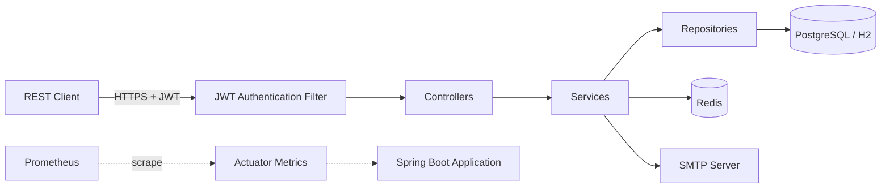

# System Overview

## 1. Purpose

The system is a **multi-tenant expense management application** that enables organizations to submit, approve, and process business expenses.

**Why it exists:**
- Provides a structured, auditable workflow for employee expense submissions
- Enforces organizational approval hierarchies and spending controls
- Supports multi-tenant isolation so multiple organizations can use the same platform independently
- Maintains a complete audit trail for compliance and reporting

**Primary objectives:**
- Automate the expense lifecycle from submission through payment processing
- Enforce role-based access control and multi-tenant data isolation
- Provide secure authentication with multi-factor authentication (MFA) support
- Deliver comprehensive audit logging for regulatory and internal compliance

---

## 2. Scope

**The application is responsible for:**
- User authentication, authorization, and account management
- Multi-tenant organization and department management
- Expense submission, approval, rejection, cancellation, and payment processing
- Role-based access control with granular permissions
- Audit logging of all security and business events
- Password management including reset flows
- Multi-factor authentication (TOTP and email OTP)

**The application is NOT responsible for:**
- Payment gateway integration (expense processing marks expenses as PROCESSED but does not execute actual financial transactions)
- Document/file attachment storage (not implemented in current codebase)
- Email delivery infrastructure (uses SMTP configuration but relies on an external mail server)
- Frontend user interface (API-only backend)
- Reporting and analytics dashboards (REPORT_READ permission exists but no reporting endpoints are implemented)
- Integration with external accounting or ERP systems

**Major boundaries:**
- The system operates as a REST API backend
- All tenant data is logically isolated via tenant ID filtering
- Authentication is stateless via JWT tokens
- Session management is handled via Redis-backed refresh tokens

---

## 3. Architecture

### 3.1 Layered Architecture

The application follows a strict layered architecture: `Controller → Service → Repository → Database`.

- **Controllers** are thin — HTTP concerns only (path mapping, request/response DTOs, validation, `ResponseEntity<ApiResponse<T>>`). No business logic.
- **Services** contain all business logic, enforce authorization and business rules, own transactions (`@Transactional` / `@Transactional(readOnly = true)`), and delegate cross-domain work to the owning domain's service.
- **Repositories** are Spring Data JPA interfaces — persistence only.
- **Mappers** (`@Component`) convert entities to DTOs; entities are never exposed through APIs.
- **Security** is enforced at two layers: method-level `@PreAuthorize("hasAuthority(...)")` and service-layer checks (tenant isolation, ownership, privilege hierarchy).



### 3.2 Package Structure

```
com.example.demo
├── controller    — REST controllers (thin, HTTP only)
├── service       — business logic, @Service
├── repository    — Spring Data JPA repositories
├── entity        — JPA entities (@Getter/@Setter/@Builder)
├── dto           — request/response DTOs (validated at API boundary)
├── mapper        — entity-to-DTO mappers (@Component)
├── constants     — Authorities, Roles, UserPermission, AuditActions
├── config        — SecurityConfig, GlobalExceptionHandler, CORS, @ConfigurationProperties
├── security      — JWT, filters, auth services, audit logger, rate limiting
└── validation    — custom validators (e.g., Password)
```

### 3.3 Technology Stack

| Concern | Technology | Notes |
|---------|------------|-------|
| Language | Java 21 | |
| Framework | Spring Boot 3.2.5 | Maven build |
| Security | Spring Security + JWT (stateless) | Method-level authorization via `@PreAuthorize` |
| Persistence | Spring Data JPA (Hibernate) | `ddl-auto=validate` (dev/test), `none` (prod) |
| Database | H2 (dev/test), PostgreSQL (prod) | Schema managed by Flyway migrations |
| Session/State | Redis | Refresh token hashes, rate-limit counters, MFA OTPs and pending sessions |
| Validation | Jakarta Bean Validation | `@Valid` on every `@RequestBody` |
| Observability | Spring Actuator, Micrometer, Prometheus | Scraped metrics and health endpoints |
| Build | Maven + Lombok | |

### 3.4 Deployment and Runtime Model

- API-only backend; no frontend, no user interface.
- Stateless JWT authentication; token revocation state (refresh tokens) is tracked in Redis.
- Multi-profile configuration: `dev`/`test` use H2 with `ddl-auto=validate`; `prod` uses PostgreSQL with `ddl-auto=none`.
- Flyway migrations run automatically on startup.
- Email delivery is synchronous via SMTP; failures are logged as warnings and do not block the requesting operation.
- Metrics are exposed through Actuator endpoints for Prometheus scraping.

---

## 4. Target Users

| User Type | Who They Are | Why They Use the System | What They Can Do |
|-----------|--------------|------------------------|------------------|
| **System Administrator (Super Admin)** | Platform operator with no tenant assignment | Manage the entire platform, all tenants, and all users across organizations | Full CRUD on tenants, users, roles, departments; view all expenses and audit logs |
| **Tenant Administrator** | Organization-level admin within a specific tenant | Manage their organization's users, departments, and settings | Create/edit users and departments within their tenant; assign roles; view tenant expenses |
| **User Manager** | HR or team lead responsible for user administration within a tenant | Create and manage user accounts for their organization | Create users, update user details, assign roles (except PLATFORM_ADMIN, TENANT_ADMIN, and USER_MANAGER) |
| **Department Manager** | Department manager who supervises expense approvals | Review and approve/reject employee expense submissions | View department expenses, approve or reject pending expenses |
| **Employee** | Regular staff member submitting business expenses | Submit expenses for reimbursement and track their status | Create, view, edit, and cancel own expenses |
| **Finance Officer** | Finance department staff responsible for payment processing | Process approved expenses for payment | View approved expenses, mark them as processed |
| **Auditor** | Compliance or internal audit personnel | Review expenses and audit logs for compliance | Read-only access to all tenant expenses, users, departments, and audit logs |

---

## 5. Roles and Responsibilities

| Role | Business Purpose | Key Capabilities |
|------|-----------------|------------------|
| **PLATFORM_ADMIN** | Full system administrator with unrestricted access across all tenants | Manage all tenants, users, roles, departments; view all expenses; view all audit logs |
| **TENANT_ADMIN** | Tenant-scoped administrator responsible for managing their organization | Manage users, departments, and settings within their tenant; assign most roles |
| **USER_MANAGER** | Organization-level user administrator | Create and manage users within their tenant; assign most roles |
| **DEPARTMENT_MANAGER** | Department-level expense approver | Review and approve/reject expenses within their department |
| **EMPLOYEE** | Expense submitter | Create, edit, cancel, and view own expenses |
| **AUDITOR** | Read-only compliance reviewer | View all tenant data including expenses, users, departments, and audit logs |
| **FINANCE** | Payment processor | Process approved expenses for payment |
| **USER** | Legacy low-privilege role | Minimal permissions; retained for backward compatibility |

---

## 6. Major Functionalities

### 6.1 Authentication and Session Management
- **What:** User login with JWT-based stateless authentication
- **Who:** All users
- **Why:** Secure access to the system
- **Key rules:** Access tokens expire in 15 minutes; refresh tokens in 7 days; tokens rotated on each refresh; all tokens revoked on logout or password change
- **Dependencies:** Redis for token storage, email service for MFA codes

### 6.2 Multi-Factor Authentication (MFA)
- **What:** Additional security layer requiring a second verification factor
- **Who:** Any authenticated user can enable; required per organizational policy (not determined from code)
- **Why:** Strengthen account security
- **Key rules:** Supports TOTP (authenticator apps) and EMAIL (one-time code); MFA setup requires code verification before activation; MFA verification is rate-limited to 10 attempts per 60-second window per user
- **Dependencies:** Email service for EMAIL method; authenticator app for TOTP

### 6.3 User Management
- **What:** CRUD operations on user accounts with role assignment
- **Who:** PLATFORM_ADMIN, TENANT_ADMIN, USER_MANAGER
- **Why:** Maintain the organization's workforce in the system
- **Key rules:** No self-registration; user manager can only manage users in their own tenant; cannot delete last admin; cannot modify users with higher privileges
- **Dependencies:** Role management, tenant management

### 6.4 Tenant Management
- **What:** CRUD operations on tenant (organization) records
- **Who:** PLATFORM_ADMIN (super admin)
- **Why:** Onboard and manage organizations on the platform
- **Key rules:** Each tenant has a unique name and status (ACTIVE/INACTIVE/SUSPENDED)
- **Dependencies:** None (top-level entity)

### 6.5 Department Management
- **What:** CRUD operations on departments within a tenant
- **Who:** PLATFORM_ADMIN, TENANT_ADMIN, USER_MANAGER (within their tenant)
- **Why:** Organize users into functional units for expense routing and approval
- **Key rules:** Departments are scoped to a tenant; each department has a manager; unique name per tenant
- **Dependencies:** Tenant management, user management

### 6.6 Role and Permission Management
- **What:** Define and manage roles with associated permissions
- **Who:** PLATFORM_ADMIN, TENANT_ADMIN
- **Why:** Control what users can do in the system
- **Key rules:** 7 built-in roles are immutable; custom roles can be created; roles assigned to users cannot be deleted; users cannot grant permissions they don't have
- **Dependencies:** Permission definitions

### 6.7 Expense Submission
- **What:** Employees create expense requests with title, description, amount, and category
- **Who:** EMPLOYEE, DEPARTMENT_MANAGER, PLATFORM_ADMIN, or any user with EXPENSE_CREATE permission
- **Why:** Initiate the reimbursement process
- **Key rules:** User must belong to a tenant; department defaults to user's department; status starts as PENDING
- **Dependencies:** Tenant and department assignment

### 6.8 Expense Approval Workflow
- **What:** Managerial review and decision on pending expenses
- **Who:** DEPARTMENT_MANAGER, PLATFORM_ADMIN, TENANT_ADMIN (with EXPENSE_APPROVE/EXPENSE_REJECT permissions)
- **Why:** Ensure expenses comply with organizational policies before payment
- **Key rules:** Only PENDING expenses can be approved/rejected; approver must be a tenant manager or department manager; records approver identity and decision date
- **Dependencies:** Expense submission

### 6.9 Expense Payment Processing
- **What:** Finance marks approved expenses as processed for payment
- **Who:** FINANCE, PLATFORM_ADMIN, TENANT_ADMIN (with EXPENSE_PROCESS permission)
- **Why:** Complete the expense reimbursement lifecycle
- **Key rules:** Only APPROVED expenses can be processed; processor must be in the same tenant; records processor identity and processing date
- **Dependencies:** Expense approval

### 6.10 Audit Logging
- **What:** Persistent record of all security and business events
- **Who:** AUDITOR, PLATFORM_ADMIN, TENANT_ADMIN (viewing); system (writing)
- **Why:** Compliance, troubleshooting, and security monitoring
- **Key rules:** Each log entry includes actor, tenant, action, resource type/id, details, and timestamp; super admins see all logs; others see only their tenant's logs
- **Dependencies:** All system operations

### 6.11 Password Management
- **What:** Password change, reset, and policy enforcement
- **Who:** All authenticated users (change); unauthenticated users (reset via email)
- **Why:** Account security and self-service recovery
- **Key rules:** Minimum 8 characters with complexity requirements; BCrypt hashing; current password required for change; reset tokens expire in 15 minutes and are single-use
- **Dependencies:** Email service for reset links

### 6.12 Account Security
- **What:** Account lockout, rate limiting, and security headers
- **Who:** System (enforcement); all users (affected)
- **Why:** Protect against brute force and unauthorized access
- **Key rules:** 5 failed attempts trigger 15-minute lockout; rate limiting on sensitive endpoints; HTTP security headers enforced
- **Dependencies:** Redis for rate limiting counters

---

## 7. Authentication and Access Control Overview

### Authentication
- Users authenticate using a username (or email) and password
- Upon successful verification, the system issues a short-lived JWT access token (15 minutes) and a longer-lived refresh token (7 days)
- If multi-factor authentication is enabled, the user must also provide a one-time code after password verification
- Refresh tokens are stored securely as SHA-256 hashes in Redis and are rotated on each use
- All tokens are revoked on logout or password change

### Authorization
- Every API request requires a valid JWT access token
- The system checks the user's roles and permissions for each operation
- Method-level security annotations enforce permission requirements (e.g., `EXPENSE_APPROVE` for approving expenses)
- Tenant isolation ensures users can only access data within their own organization (unless they are a super admin)
- Ownership checks ensure employees can only modify their own expenses
- Privilege hierarchy prevents users from managing others with equal or higher permissions

### Major Security Boundaries
- Unauthenticated users can only access login, token refresh, and password reset endpoints
- All other endpoints require authentication
- Sensitive operations (user management, expense approval, audit log access) require specific permissions
- Cross-tenant data access is blocked at the service layer

---

## 8. External Systems and Integrations

| System | Purpose | Information Exchanged | Direction | When Used |
|--------|---------|----------------------|-----------|-----------|
| **Email Server (SMTP)** | Deliver transactional emails | Password reset links, email verification links, MFA OTP codes | Outbound | Password reset, email verification, MFA via EMAIL method |
| **Redis** | Token storage, rate limiting, caching, MFA session storage | Refresh token hashes, rate limit counters, OTP codes, MFA session tokens, cached data | Bidirectional | Login, refresh, logout, MFA verification, all cached operations |
| **Prometheus/Micrometer** | Application metrics and monitoring | Health status, request metrics, JVM metrics | Outbound | Exposed via actuator endpoints for scraping |
| **Database (PostgreSQL/H2)** | Persistent data storage | All business entities (users, tenants, expenses, audit logs, etc.) | Bidirectional | All application operations |

---

## 9. Data Overview

### Tenants
Organizations that use the system. Each tenant represents a separate company or business unit. All data within the system is isolated by tenant.

### Users
Individuals who have accounts in the system. Each user belongs to one tenant and may belong to one department. Users have roles that determine their permissions.

### Roles
Named collections of permissions. The system has 8 built-in roles (PLATFORM_ADMIN, TENANT_ADMIN, USER_MANAGER, DEPARTMENT_MANAGER, EMPLOYEE, AUDITOR, FINANCE, USER) that cannot be modified. Custom roles can be created by administrators.

### Permissions
28 granular access rights (e.g., EXPENSE_CREATE, USER_READ, TENANT_UPDATE) that control what operations a user can perform.

### Departments
Organizational units within a tenant. Each department has a name (unique within the tenant) and a designated manager. Departments group users and are used for expense routing and approval.

### Expenses
Business expense requests submitted by employees. Each expense has a title, description, amount, category, and status. Expenses follow a lifecycle: PENDING → APPROVED/REJECTED/CANCELLED → PROCESSED.

### Audit Logs
Immutable records of all significant system events. Each log entry captures who performed an action, what was done, when it occurred, and which tenant and resource were affected.

### Refresh Tokens
Secure references to active login sessions. Stored as one-way hashes in Redis with expiration times.

### Password Reset Tokens
Single-use tokens for password recovery. Stored as one-way hashes with 15-minute expiration.

---

## 10. Notifications and Background Processing

### Scheduled Processes
- **Password Reset Token Cleanup:** A daily scheduled job (runs at midnight) deletes expired or used password reset tokens from the database.

### Background Processing
- No asynchronous background jobs are defined in the current implementation.
- Email sending is synchronous (occurs during the request lifecycle).

### Notifications
- Password reset emails are sent when a user requests a password reset.
- MFA OTP codes are sent via email when the EMAIL MFA method is used.
- Email sending failures are logged as warnings but do not block the requesting operation.

---

## 11. System Boundaries

### Inside the Application
- User authentication and JWT token management
- Role and permission-based authorization
- Multi-tenant data isolation
- Expense CRUD and workflow management
- User, tenant, department, and role management
- Audit log recording and retrieval
- Password management and reset flows
- MFA setup and verification
- Rate limiting and account lockout
- Input validation and error handling

### Outside the Application
- Frontend user interface (separate application)
- Email delivery infrastructure (SMTP server)
- Payment processing systems (actual fund transfers)
- External accounting or ERP integrations
- Identity providers (no external SSO integration in current implementation)
- File storage systems (no document attachment support)

### Through External Integrations
- **Email Server:** Outbound email delivery for password resets, verification, and MFA codes
- **Redis:** Token storage, rate limiting, caching, and session management
- **Prometheus:** Metrics collection and monitoring

---

## 12. Related Documents

The detailed behavioral content that previously lived in this overview is maintained in `functional-requirements.md` to avoid duplication:

| Topic | Location |
|-------|----------|
| End-to-end user workflows (login, MFA, expenses, password reset) | `functional-requirements.md` §7 Business Processes |
| Business rules catalog (BR-001 – BR-020) | `functional-requirements.md` §12 Business Rules Catalog |
| Requirements catalog and traceability (FR-001 – FR-044) | `functional-requirements.md` §13 – §14 |
| API endpoint index (method, path, authority, FR mapping) | `functional-requirements.md` §15 API Endpoint Index |
| Important constraints (security, data, integration, operations) | `functional-requirements.md` §17 Constraints |
| Glossary of domain and technical terms | `functional-requirements.md` §18 Glossary |

---

## 13. Document Accuracy

### Documentation Notes

**Confidently confirmed from implementation:**
- All REST endpoints, their paths, HTTP methods, and required authorities
- All entity relationships and data model
- All 7 built-in roles and their permission sets
- Complete expense lifecycle (PENDING → APPROVED/REJECTED/CANCELLED → PROCESSED)
- JWT authentication flow including access/refresh token rotation
- MFA setup and verification flow (TOTP and EMAIL methods)
- Account lockout after 5 failed login attempts
- Rate limiting on sensitive endpoints (including MFA verification: 10 attempts per 60-second window per user)
- Password complexity requirements and hashing (BCrypt strength 12)
- Password reset flow with 15-minute token expiry
- Tenant isolation across all data queries
- Audit logging for security and business events
- Scheduled cleanup of expired password reset tokens (daily at midnight)
- Redis usage for token storage, rate limiting, caching, and MFA sessions
- Email integration for password reset, verification, and MFA codes
- Prometheus/Micrometer metrics exposure
- Privilege hierarchy enforcement (users cannot manage higher-privileged users)
- Last admin protection (cannot delete or disable)

**Areas where behavior was ambiguous:**
- Whether email verification is fully implemented (endpoint exists but verification flow is not fully wired in current codebase)
- Whether the USER role is actively used or retained solely for backward compatibility
- Whether the REPORT_READ permission is utilized (permission exists but no reporting endpoints are implemented)
- Organization-wide MFA policy enforcement (individual users can enable/disable MFA, but no tenant-level MFA requirement is enforced in the current implementation)

**Areas that require confirmation from business stakeholders:**
- Specific business justification for each of the 28 permissions
- Whether additional expense statuses or workflow transitions are planned
- Whether file attachment support for expenses is planned
- Whether integration with external accounting/payment systems is planned
- Specific email templates and content for transactional emails
- Whether reporting/dashboard functionality is planned for the REPORT_READ permission
- Tenant lifecycle management (what happens when a tenant is SUSPENDED or INACTIVE)
- Data retention policies for audit logs and expense records